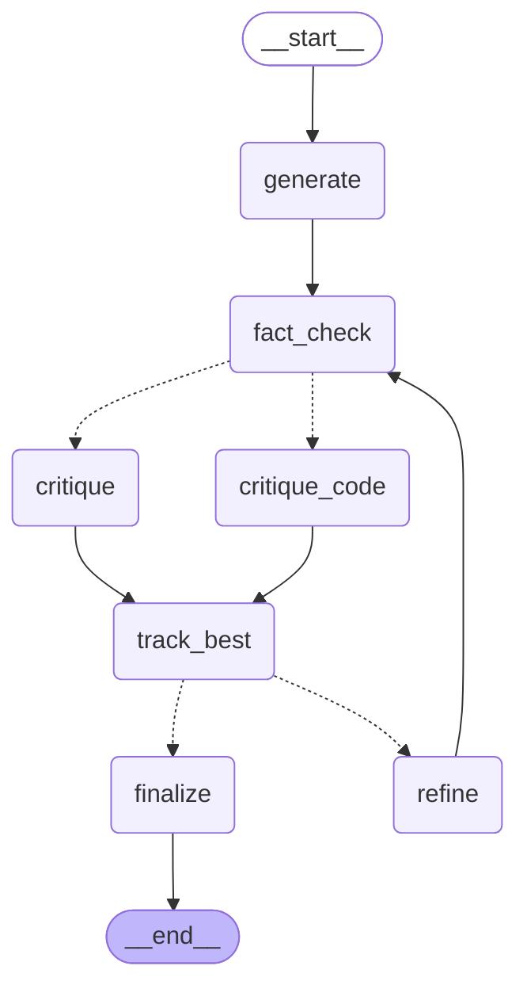

```mermaid
graph TD;
	__start__([<p>__start__</p>]):::first
	generate(generate)
	fact_check(fact_check)
	critique(critique)
	critique_code(critique_code)
	refine(refine)
	track_best(track_best)
	finalize(finalize)
	__end__([<p>__end__</p>]):::last
	__start__ --> generate;
	critique --> track_best;
	critique_code --> track_best;
	fact_check -.-> critique;
	fact_check -.-> critique_code;
	generate --> fact_check;
	refine --> fact_check;
	track_best -.-> finalize;
	track_best -.-> refine;
	finalize --> __end__;
	classDef default fill:#f2f0ff,line-height:1.2
	classDef first fill-opacity:0
	classDef last fill:#bfb6fc
```